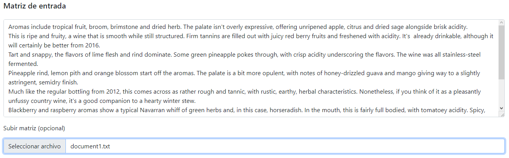
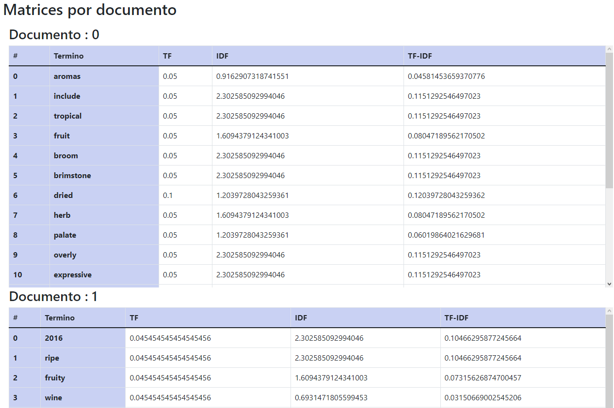
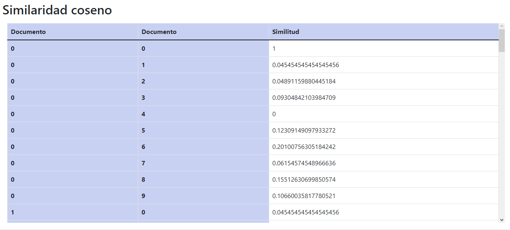
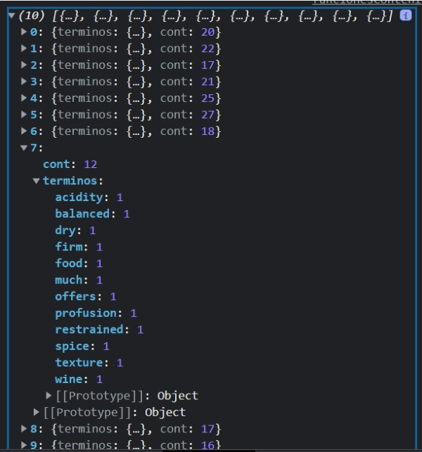
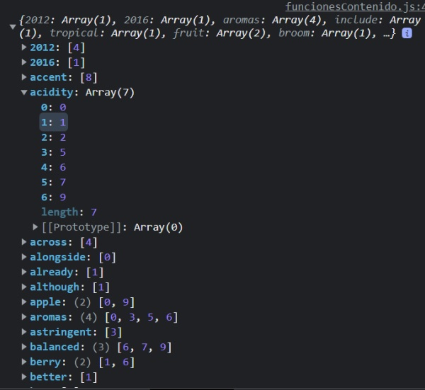
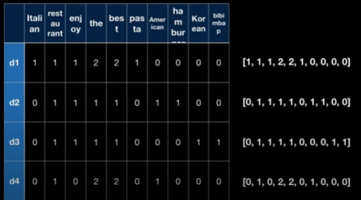
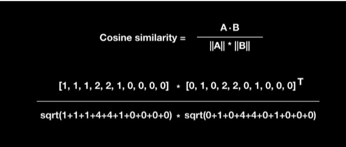
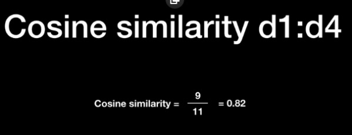
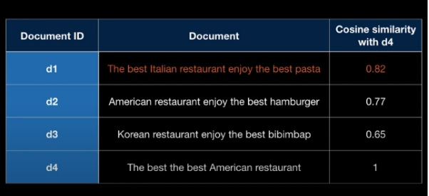

## Pagina de la app

[Sistemas de recomendación - Modelos Basados en el Contenido](https://alu0101281308.github.io/GCOP2/)

# Sistema de recomendación - Modelos Basados en el Contenido

Para usar la aplicación unicamente debe subir un fichero de texto donde cada linea figure un documento, o bien escribirlo a mano dentro del campo de entrada de la matriz.

Una vez cargado el documento, solo se debe apretar el boton calcular para generar las tablas.

 ## Ejemplo de uso

 Se carga el fichero de texto :

    

 Hacer click en el boton calcular luego de haber cargado el fichero de texto para generar las tablas :
 
  

 Al final de las tablas se encuentra la similaridad entre los documentos con la formula de similitud coseno :
 
  

 # Codigo

El funcionamiento del código para esta práctica la iré explicando conforme se van llamando las funciones. Para empezar es necesario explicar las variables :
- documentos: Es un array que se guardará la información de cada documento por posición, es decir, la información del documento 0 se guardará en documentos[0] y así consecutivamente.
- diccionarioGlobal: Es un hash que almacenará como clave cada palabra de todos los documentos y como valor será un contador que indicará la cantidad de documentos en la que dicha palabra aparece.
- STOPWORDS: Es un array de palabras que filtraran los términos que se van a usar para el modelo, contienen conectores en español e inglés.

## calcularMatriz
Esta función se llama al dar click en el botón calcular de la interfaz web, es la función principal que llama a las demás funciones del programa en orden.

## cargarDocumentos
Lee el input de la entrada de texto y separa por línea cada documento, luego hace un loop para cada línea ( es decir, cada documento del fichero de texto ) llamando a la funcion ‘extraerTerminos’’.

## extraerTerminos(documento, index)
Esta función recibe un documento para separarlo en términos o palabras claves que serán usadas posteriormente para calcular el TF-IDF.

Primeramente separa por terminos el documento recibido usando como separado el espacio en blanco, seguidamente para cada termino se llama a la función limparTermino que limpia el término de los símbolos : , . ‘ ’ ? ! para posteriormente filtrarlo en el array de STOPWRDS.

Al finalizar la extracción de palabras, filtramos las posiciones del array para eliminar las posiciones vacías debido a las palabras filtradas del STOPWORDS.

Una vez obtengo los términos relevantes, cuento sus repeticiones con ayuda de un hash individual para cada documento llamado diccionario y también uso el hash de diccionarioGlobal para aumentar el número de documentos cada vez que encuentre la palabra ( siempre y cuando sea un documento distinto )

Por último, creo un objeto que tiene el atributo término, el cual guarda el hash diccionario y un cont que guarda el tamaño del arreglo de términos, es decir el total de palabras del documento.

Finalizada la llamada de cargarDocumentos, la variable documentos y diccionarioGlobal contendrá toda la información necesaria para calcular el tf-idf y aplicar la fórmula de similitud coseno.

Si hacemos un console log de documentos tendremos lo siguiente : 

 

Como se puede observar, cada posición del array documentos contiene un objeto con 2 atributos, el término que es el diccionario de palabras cuya función es saber cuantas veces se repite esa misma palabra en ese documento y un contador de palabras totales del documento, como ejemplo desplegue el documento número 7 el cual indica que hay en total 12 palabras clave y cada palabra solo se repite 1 sola vez en ese documento.

Si hacemos un console log de dicconarioGlobal tendremos lo siguiente : 

 

Un hash donde cada clave es una palabra clave y su valor es un array que representa el número del documento donde se encontró esa palabra, como ejemplo, la palabra acidity se encontró en 7 documentos diferentes : en el 0, 1, 2, 5, 6, 7, 9.

## borrarMatrices
Simplemente limpia el html para mostrar un nuevo resultado.
crearMatrices
Este crea el código html a la que mostrará las matrices de cada documento a la vez de llamar a las funciones de cálculo dependiendo del caso.

## calcularTF
Recibe un término y el index de un documento para regresar la frecuencia de dicho termino en el documento[index], esto se traduce como las veces en que el término aparece en el documento dividido entre todas las palabras del documento.

## calcularIDF
Recibe un término y devolverá la frecuencia inversa calculada como el log del número total de documentos dividido entre el total de documentos en el que el término aparece.

## similitudCoseno
Recibe 2 documentos y devuelve la similitud entre ellos, siendo 1 una similitud exacta y 0 todo lo contrario, calculado como el producto de los vectores de los términos en cada documento dividido por la logintud de dichos vectores.

Tomaré como ejemplo un ejercicio sacado de este video.

Se tienen los siguientes documentos : 

 

Luego se obtienen sus vectores donde cada posición es las veces que se repiten TODOS los términos por documento :

 

Se aplica la fórmula tomando como ejemplo el doc1 y el doc4:

 
 
 

